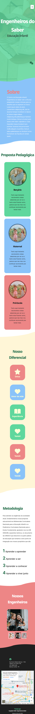
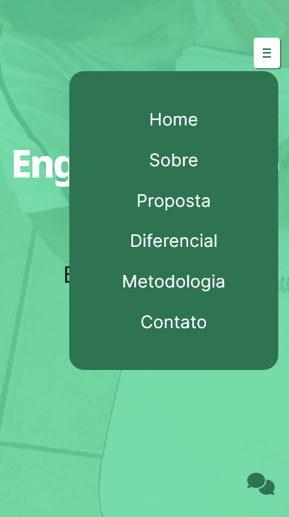
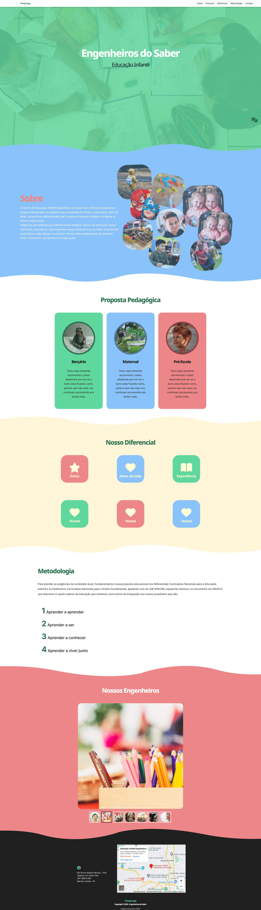
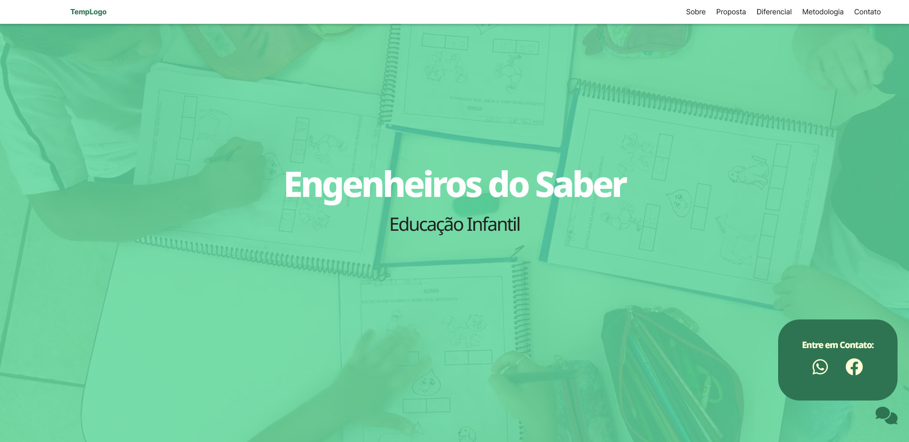

# The Project
 This is a personal challenge and practice project using a real world case, my mother's school. Since it's a small school, it doesn't have a webpage, and I decided to make one using what I had learned this far. Since I started this project I've learned a lot of new things that I would like to change in this project, but it would demand too much time, so I decided to continue working with what I had and at least come to a presentable conclusion. My idea is to keep improving or even remaking this project with the new concepts and knowledge that I gain and learn.
 
## Figma Layout
[Initial Design Idea](https://www.figma.com/file/3kHv3yqDSopYvmx0GZZqji/Layout-Escola?node-id=0%3A1)

## Screenshots
### Mobile

### Desktop

## Live Site

[Engenheiros Do Saber](https://engenheiros-do-saber.netlify.app/)

## What I've Learned

- Creating a layout from scratch and working it out to make it presentable.
- Got to practice a lot of basic React, like componentization, using props and useState hooks.
- Learned that SASS is amazing but Tailwind is just better for the productivity you get.
- 

## What I know is not good enough and need to improve

- I've started with a Desktop focus and changed to Mobile later, bringing some avoidable trouble.
- Accessibility is pretty much non-existant.
- Responsiveness is not perfect and can break according to different browsers.
- Started the project with a single global SCSS file, that even with nesting became a huge nuisance that I tried to resolve by breaking it into one file per component; it alleviated the problem but did not resolve it.
- Used Create-React-App, which I learned is not exacly deprecated but there's better options around now, like Vite.
- Needs more detailing, refining and real information and pictures. But that would take a lot o time.
- Need to simplify my CSS properties, a lot of the time I add some that are simply not needed or redundant.

## What I would change or do differently

- Use TailwindCSS
- Create the project using Vite
- Start with Accessibility as a focus
- Start with Mobile first
